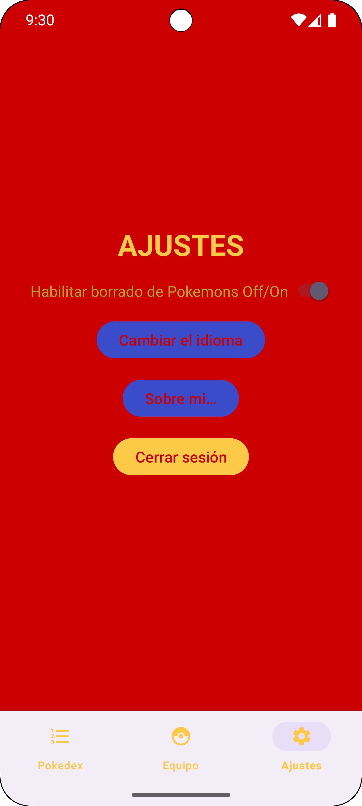

# Introducción

Esta app móvil desarrollada en **Java** permite a los usuarios crear y gestionar una lista de Pokémon capturados.  
Para acceder a la aplicación se requiere registro mediante email o cuenta de Google.  

La aplicación consta de tres pestañas:  
- **Pokedex**: muestra la lista de Pokémon disponibles.  
- **Equipo**: muestra los Pokémon capturados por el usuario y permite consultar sus detalles.  
- **Ajustes**: donde el usuario puede:  
  - Permitir o denegar el borrado de Pokémon en su equipo.  
  - Cambiar el idioma entre español e inglés.  
  - Cerrar sesión.  

---

# Características principales

- **Bottom Navigation**: implementación de un menú de navegación en la parte inferior que permite la navegación entre diferentes secciones de la aplicación.  
- **NavHostFragment**: uso de NavHostFragment para gestionar la navegación entre fragmentos de manera intuitiva.  
- **RecyclerViews con CardViews**: muestran y organizan el contenido de manera eficiente y ordenada.  
- **Fragments**: albergan de manera ordenada y separada las distintas funcionalidades de la app.  

---

# Tecnologías empleadas

- **Firebase**: para la autenticación y registro de usuarios, y base de datos.  
- **Retrofit y Gson**: para hacer llamadas, consultar y procesar el contenido de la API de la que extraemos la información.  
- **Glide**: para trabajar con imágenes desde URL.  

---

# Conclusiones del desarrollador

Este trabajo ha supuesto todo un reto en cuanto a dificultad, tiempo y ejecución. Estoy muy contento con el resultado y siento que ha servido para afianzar y fortalecer mis conocimientos en el desarrollo de aplicaciones Android.

---

# Capturas
---

---

---

---

---

---

